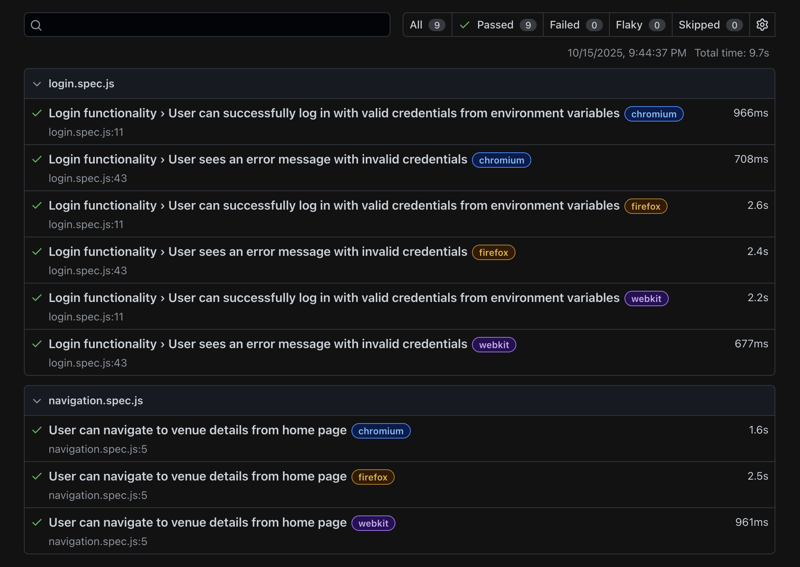

# 🌐 Holidaze Venue Booking

This project is a front-end web application for booking venues. It supports user registration, login, and venue browsing. The project includes automated testing and code quality tools for a smooth developer experience.

---

## 📦 Tech Stack

- **Languages & Tools**: HTML, CSS, JavaScript (ESModules)
- **Build Tool**: [Vite](https://vitejs.dev/)
- **Testing**:
  - [Vitest](https://vitest.dev/) – unit testing
  - [Playwright](https://playwright.dev/) – end-to-end (E2E) testing
- **Linting & Formatting**:
  - [ESLint](https://eslint.org/) – JavaScript linting
  - [Prettier](https://prettier.io/) – code formatting
- **Git Hooks & Linting Automation**:
  - [Husky](https://typicode.github.io/husky)
  - [lint-staged](https://github.com/okonet/lint-staged)

---

## 🚀 Getting Started

### 1. Clone the Repository

```bash
git clone https://github.com/Nirush4/workflow-repo-ca-nirush
```

```bash
cd workflow-repo-ca-nirush
```

---

### Install Dependencies

```bash
npm install
```

### Start the Development Server

```bash
npm run dev
```

---

## 🧪 Testing Guide

This project uses Vitest for unit testing and Playwright for end-to-end testing.

---

### 📁 Test Files

- Unit tests: Located in the js/utils folder and follow the naming convention \*utils.test.js.
- E2E tests: Located in the tests/ or e2e/ directories.

---

### ▶ Unit Testing (Vitest)

#### ⚙ Configuration

- Config file: vitest.config.js
- Uses jsdom for browser-like testing environment.

---

## 🧪 Run Unit Tests

```bash
npm run test
# or
npm test
```

---

## 📊 Run Tests with Coverage

- Make sure this script exists in your package.json:

```bash
"scripts": {
  "coverage": "vitest run --coverage"
}
```

Then run:

```bash
npm run coverage
```

## ▶ End-to-End Testing (Playwright)

### ⚙ Setup

Install Playwright and its required browser binaries:

```bash
npx playwright install
```

### 🧪 Run All E2E Tests

```bash
npx playwright test
```

### 👁 Run E2E Tests in Headed Mode

```bash
npx playwright test --headed
```

### 👁 Run E2E Tests in UI Mode

```bash
npx playwright test --ui
```

### 🧪 Open Playwright Test Report

After running tests, open the HTML report:

```bash
npx playwright show-report
```

## All tests passed successfully


![![E2E UI Test]](image-4.png)


## Contact 📬

- [](https://www.linkedin.com/in/nirushan-rajamanoharan-056765209/)

- [](https://github.com/Nirush4)

## Author 👨‍💻​

• Nirushan Rajamanoharan (@Nirush4)
