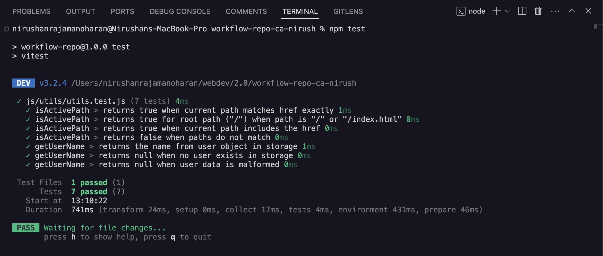
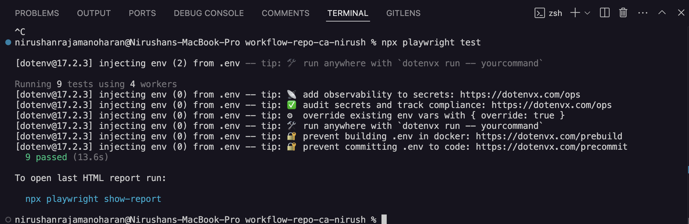

# 🌐 Holidaze Venue Booking

This project is a front-end web application for booking venues. It supports user registration, login, and venue browsing. The project includes automated testing and code quality tools for a smooth developer experience.

---

## 📦 Tech Stack

- HTML, CSS, JavaScript (ESModules)
- [Vite](https://vitejs.dev/) (build tool)
- [Playwright](https://playwright.dev/) – end-to-end testing
- [Vitest](https://vitest.dev/) – unit testing
- [ESLint](https://eslint.org/) – JavaScript linting
- [Prettier](https://prettier.io/) – code formatting
- [Husky](https://typicode.github.io/husky) – Git hooks
- [lint-staged](https://github.com/okonet/lint-staged) – run linters on staged files

---

## 🚀 Getting Started

### 1. Clone the repository

```bash
git clone https://github.com/YOUR-USERNAME/holidaze-venue-booking.git
cd holidaze-venue-booking
```

## 🧪 Testing Configuration

### Vitest

- **Config file**: `vitest.config.js`
- Set up for browser-like environment using [`jsdom`](https://github.com/jsdom/jsdom).

### Playwright

- **Config file**: `playwright.config.js` (if added)
- To install necessary browsers for testing:

```bash
npx playwright install


## 🧪 Running Tests

### ▶ Unit Tests (Vitest)
npm run test / npm test

### ▶ E2E Tests (Playwright)

npx playwright test

```

## All tests passed successfully



![![E2E UI Test]](image-2.png)

## Contact 📬

- [](https://www.linkedin.com/in/nirushan-rajamanoharan-056765209/)

- [](https://github.com/Nirush4)

## Author 👨‍💻​

• Nirushan Rajamanoharan (@Nirush4)
